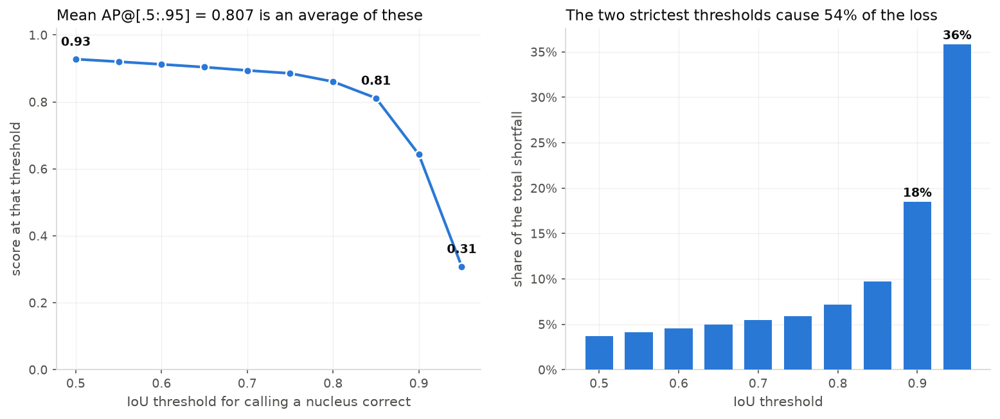
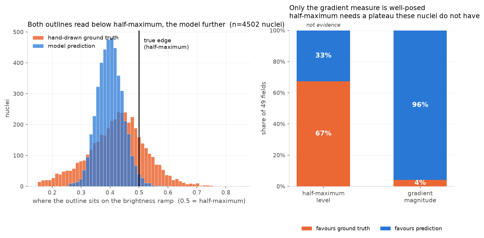
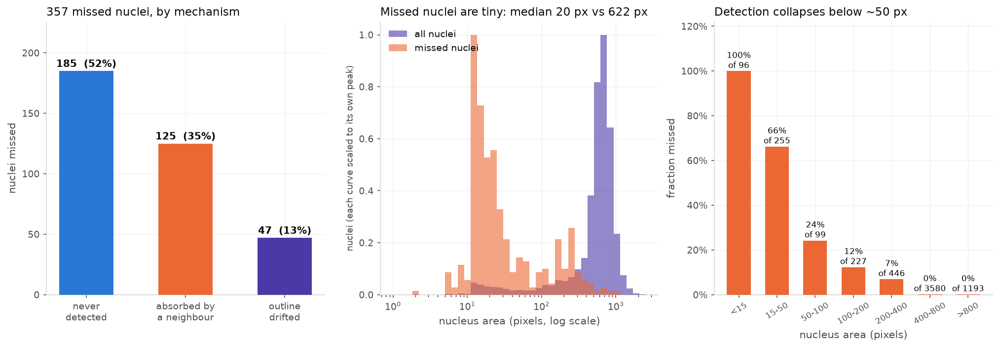
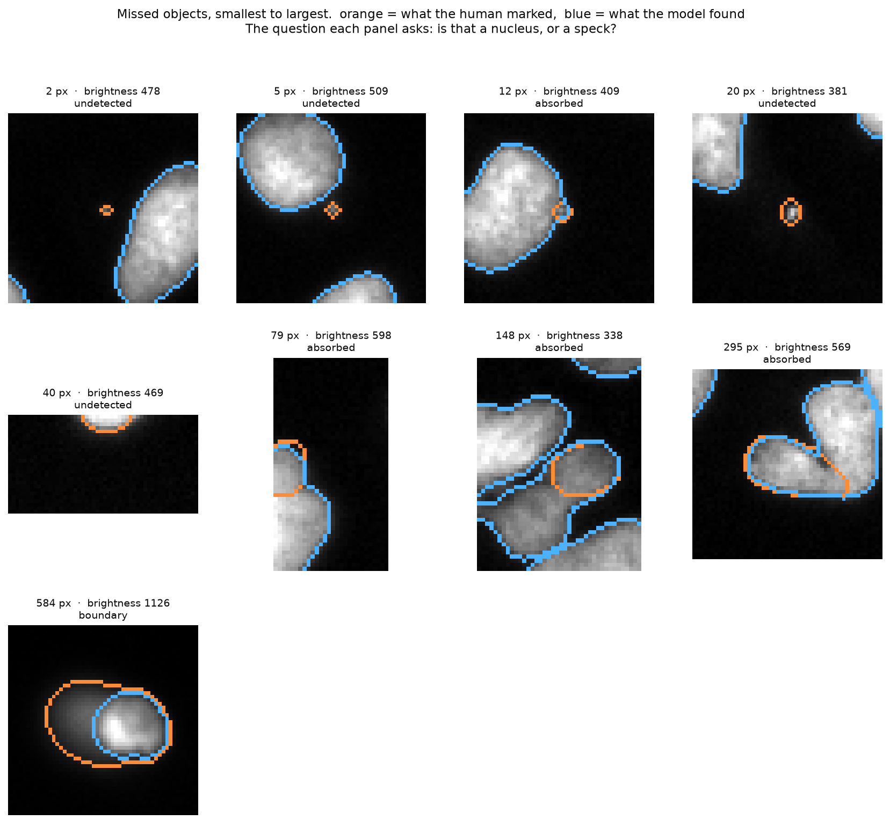
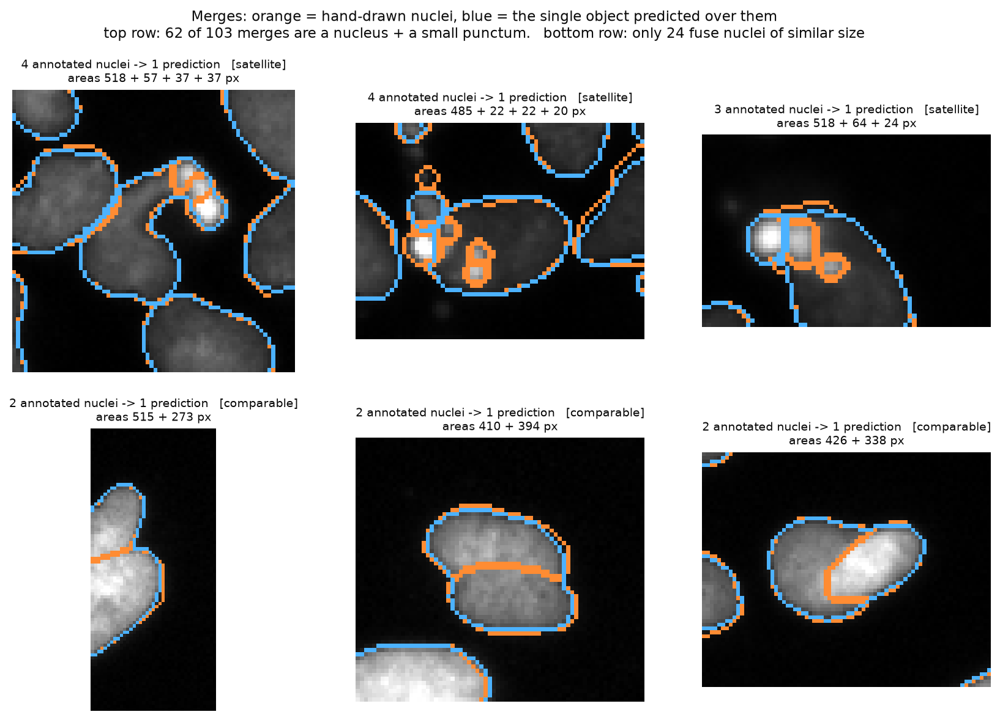
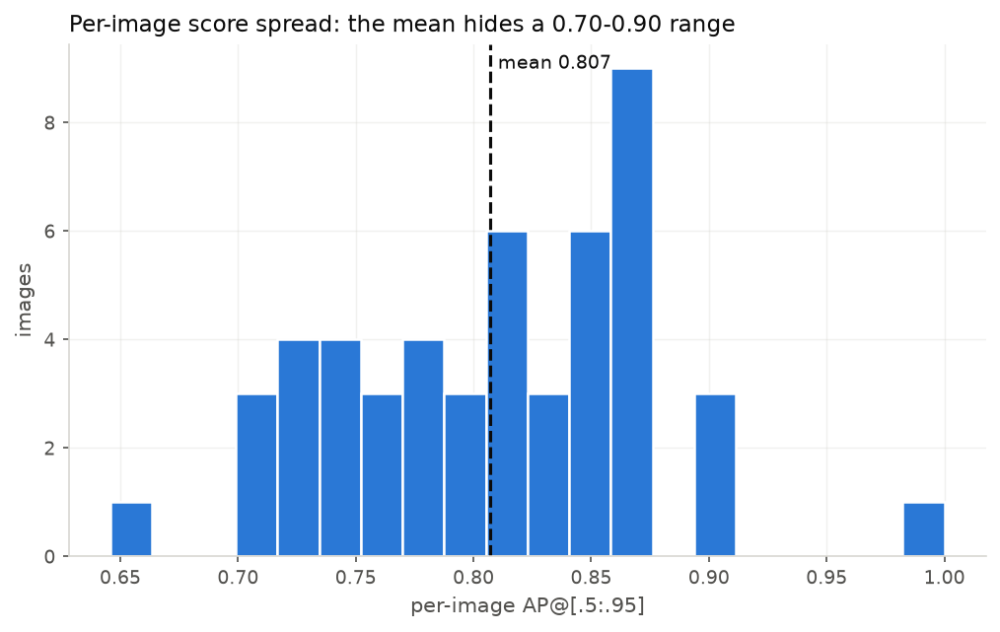

# Nuclei instance segmentation on BBBC039

Segments individual nuclei from fluorescence microscopy images and scores itself
against hand-annotated ground truth, on the 200-field
[BBBC039](https://bbbc.broadinstitute.org/BBBC039) benchmark.

**Headline result:** mean AP@[.5:.95] of **0.791** on the held-out test split
(95% CI [0.766, 0.812]), 95.6% F1 at IoU 0.5.

**The finding that matters more.** Split the shortfall by cause and **63% of it is
boundary placement on objects the model already found correctly**, against 37% for
detection. At the strictest thresholds "correct" means matching a hand-drawn
outline to within about half a pixel, and at that scale the two outlines differ
systematically: the model's boundary sits on the steeper part of the intensity
ramp in **47 of 49 fields**. So most of the headline metric is arbitrating a
sub-pixel placement difference rather than whether the right nucleus was found, and
no amount of tuning reaches it.

Two earlier versions of this claim were stronger and wrong. The first was an
artifact of how boundary pixels were sampled; the second leaned on a half-maximum
statistic whose reference turns out not to exist for these objects — nuclei have no
intensity plateau. §1 documents both, and what survives them.

Everything below was measured on this machine and is committed alongside the
numbers in [`results/`](results/), so each figure quoted can be checked against
the file that produced it.

---

## Contents

- [Quickstart](#quickstart) · [Results](#results) · [The optimization](#the-one-thing-optimized-deliberately)
- [Where it fails](#where-it-fails) — the main section
- [What I tested and refuted](#what-i-tested-and-refuted) — eleven hypotheses, with numbers
- [Approach](#approach) · [The dataset trap](#the-ground-truth-is-not-what-it-looks-like) · [Metric conventions](#metric-conventions)
- [What I'd try next](#what-id-try-next) · [Limitations](#limitations)

## Quickstart

From a clean clone:

```bash
git clone https://github.com/Tejas-Sukesh/bbbc039-nuclei-segmentation.git
cd bbbc039-nuclei-segmentation
python3 -m venv .venv && source .venv/bin/activate
pip install -e .

bash scripts/download_data.sh     # ~80 MB from the Broad Institute
python -m pytest tests/ -q        # 37 tests
python -m nucleiseg.data          # sanity check; must total 23,617 nuclei
```

That last command must print:

```
training    images=100 nuclei= 12001 mean= 120.0 min=  0 max=194 empty_fields=2
validation  images= 50 nuclei=  5896 mean= 117.9 min=  0 max=231 empty_fields=1
test        images= 50 nuclei=  5720 mean= 114.4 min=  7 max=202 empty_fields=0
```

**If the nuclei counts differ, the mask decoding is wrong** — see
[the dataset trap](#the-ground-truth-is-not-what-it-looks-like).

Then reproduce the results, in order:

```bash
python scripts/01_cache_flows.py                 # ~10 s/image, once, resumable
python scripts/08_flowcache_benchmark.py         # the optimization, measured
python -m nucleiseg.evaluate --split validation --tag cellpose_default_validation
python scripts/05_failure_analysis.py --split validation
python scripts/06_figures.py

python scripts/01_cache_flows.py --augment --splits validation test
python scripts/07_tta_comparison.py --split validation
python scripts/07_tta_comparison.py --split test   # the held-out number

python scripts/09_diameter.py --diameters 15       # input rescaling
python scripts/10_input_level.py                   # + local normalization
python scripts/11_residual_pass.py                 # second-pass small-object detector
```

Only step 1 is slow (~35 min for all 200 fields). Everything after it reads the
cache and runs in seconds — which is the point of
[the optimization](#the-one-thing-optimized-deliberately).

## Results

Cellpose-SAM at its stock parameters, its own test-time augmentation, and a
from-scratch classical pipeline, all scored identically. Intervals are
percentile bootstrap over images.

**Validation** (50 fields, 5,896 nuclei) — every parameter choice was made here.

| Method | AP@[.5:.95] | 95% CI | F1@0.5 | mean IoU | splits | merges | count bias |
|---|---|---|---|---|---|---|---|
| Classical (Otsu → distance → watershed) | 0.555 | [0.515, 0.588] | 0.821 | 0.892 | 405 | 169 | −0.19% |
| **Cellpose-SAM, stock parameters** | **0.807** | [0.789, 0.825] | 0.962 | 0.928 | 24 | 103 | −4.51% |
| Cellpose-SAM + test-time augmentation | 0.809 | [0.792, 0.827] | 0.962 | 0.929 | 25 | 99 | −4.61% |

**Test** (50 fields, 5,720 nuclei) — touched only after the above was settled.

| Method | AP@[.5:.95] | 95% CI | F1@0.5 | mean IoU | splits | merges | count bias |
|---|---|---|---|---|---|---|---|
| Classical | 0.576 | [0.548, 0.600] | 0.858 | 0.886 | 364 | 197 | −0.42% |
| **Cellpose-SAM, stock parameters** | **0.791** | [0.766, 0.812] | 0.956 | 0.926 | 16 | 114 | −4.32% |
| Cellpose-SAM + test-time augmentation | 0.792 | [0.767, 0.813] | 0.956 | 0.926 | 15 | 120 | −4.30% |

Two things to read off this table beyond the ranking.

**The classical pipeline's count bias is the best in the table, and that is a
trap.** At −0.19% it looks better calibrated than Cellpose's −4.5%, but it gets
there by making 405 splits *and* 169 merges — 574 topology errors that cancel in
the object count. This is exactly why
[splits and merges are counted separately](#metric-conventions) from any
count-based statistic. A single aggregate would have called the worse pipeline
better calibrated.

**Test scores below validation, consistently** (0.791 vs 0.807), across all three
methods. Since no method was tuned, this is a property of the splits rather than
overfitting: the test fields are slightly harder.

## The one thing optimized deliberately

**First, the accuracy answer, because it is the one the brief is really asking
for: I could not move it.** Six interventions, each chosen by measurement, are
documented in [what I tested and refuted](#what-i-tested-and-refuted). The best of
them is +0.0021 AP against a bootstrap interval of ±0.018 — the noise is nine
times the effect, and `evaluate.compare()` prints a warning saying so rather than
letting it be quoted as a win. Test-time augmentation, parameter tuning, adaptive
search, input rescaling, and local normalisation are all honestly negative on the
headline metric.

One of them changed the *error profile* substantially even though the total did
not move: 2× input rescaling cut merges from 103 to 69 and halved genuine
two-nuclei fusions, trading them for more splits and false positives. That trade
is only visible because splits and merges are counted separately, and it is the
nearest thing here to an accuracy result.

**What I can report as a measured, verified optimization is compute.**

**FlowCache: 8.79 s → 0.109 s per parameter evaluation, a ~72× speedup, with
bit-identical output.** Measured by
[`scripts/08_flowcache_benchmark.py`](scripts/08_flowcache_benchmark.py), saved
to [`results/flowcache_benchmark.json`](results/flowcache_benchmark.json).

Cellpose-SAM inference costs ~9 s per field on Apple Silicon MPS, which makes any
parameter search impractical — the 18-arm grid over 50 validation images is 900
evaluations, **2.2 hours** at that rate. But the expensive part is only the
network forward pass, which emits a flow field `dP` and a probability map
`cellprob`. Everything the tunable parameters touch happens *after* that, in
`cellpose.dynamics.resize_and_compute_masks`.

So the network runs once per image, its two output arrays are cached to disk as
float16, and the parameters are swept over the cache. The same 900 evaluations
now take **1.6 minutes**.

The equivalence has to be exact rather than approximate, because the float16 cast
is lossy. `np.array_equal` on the resulting label images returns `True` on every
image tested — identical instances, which is the property that matters, not
identical intermediates. The benchmark script fails loudly if that ever stops
holding, because a speedup that quietly perturbs the masks is not a speedup.

This also partitions the parameters, which is what any optimizer over them needs
to know:

- **cheap**, recomputed from the cache: `cellprob_threshold`, `flow_threshold`,
  `min_size`, `max_size_fraction`, `niter`
- **expensive**, requiring a network pass: `augment`, `normalize`, `diameter`,
  model choice, tiling

One caveat on the number itself: the first of the three timed images includes
loading the 1.2 GB checkpoint, so the mean-based 81× flatters it slightly. The
median-based figure is **~72×**, which is the one I would quote.

## Where it fails

### 1. The metric's strict end measures a sub-pixel convention difference



The headline 0.807 is an average of ten numbers, and they are wildly unequal. At
IoU 0.50 the score is 0.928; at 0.95 it is 0.309. The right panel converts that
into shares of the total shortfall: **the two strictest thresholds cause 54% of
the entire gap to a perfect score.**

Splitting that shortfall by *cause* rather than by threshold needs more care than
it first appears. The shortfall at IoU 0.50 is 0.072 — those are objects that fail
even the loosest test, i.e. genuine detection failures. It is tempting to divide
that by the 1.93 total and call detection 4% of the problem, but that is a
category error: it compares one threshold's shortfall against a ten-threshold
total. **A detection failure is a floor — an object that never matches at 0.50
also fails at every stricter threshold**, so it recurs in all ten terms:

| cause | contribution | share |
|---|---|---|
| detection (10 × 0.072, the recurring floor) | 0.721 | **37%** |
| boundary localisation (the remainder) | 1.210 | **63%** |

So roughly **two thirds** of the gap is boundary placement on objects already
found correctly, and one third is detection. That is still the finding that
redirects everything — just not by the factor of ten the naive arithmetic
suggested.

Mean IoU over matched objects is 0.928. For a median nucleus of 622 px that is
roughly **half a pixel** of average boundary displacement. So the question is what
a threshold demanding sub-pixel agreement with a hand tracing is actually
measuring.

That is a claim about the ground truth, so it needs a referee that is neither
outline. [`boundary.py`](src/nucleiseg/boundary.py) uses the image, two ways:

- **gradient magnitude** — how steep the intensity ramp is under the outline.
  Reference-free: the comparison divides both outlines by the same local contrast,
  so any calibration error cancels exactly. Well-defined whatever shape the
  intensity profile has.
- **half-maximum level** — where the outline sits between the nucleus interior and
  the background, with 0.5 as the conventional sub-pixel edge. This one turned out
  **not to be measurable on this data**; see below.



**A methodological correction, because it changed the answer.** The first version
of this measurement sampled `find_boundaries(mask, mode="inner")` — the ring of
pixels just inside each mask. That ring sits about half a pixel inside the true
contour, which is the same scale as the effect being measured, and the bias is not
common-mode: an outline that is slightly too *large* lands its inner ring nearer
the real edge and therefore scores better. On a synthetic sweep with the ground
truth placed exactly on half-maximum and the prediction 0.25 px too large, that
version picks the wrong outline in **9 of 9** configurations, and the gradient
variant in 7 of 9. Because the model's masks here genuinely are larger than the
annotation's, the artifact alone could have produced the entire original result —
which reported the model closer in 48 of 49 fields.

Sampling the marching-squares contour and interpolating along it is correct in
9 of 9 on the same sweep, for both statistics. Every number below is from the
corrected version. **The original claim did not survive it.**

Over 4,502 nuclei in 49 fields, aggregated per field:

| statistic | favours | fields | p |
|---|---|---|---|
| gradient magnitude | **the prediction** | 47 of 49 (96%) | 7 × 10⁻¹² |
| half-maximum level | *(not measurable — see below)* | — | — |

**Why the level statistic is not evidence, rather than merely uncalibrated.** It
asks whether `|level − 0.5|` is smaller, which requires 0.5 to be correctly
located, which requires a "maximum" — a plateau the edge ramp rises to. I assumed
one existed. So I measured the mean radial intensity profile of real nuclei,
normalised by each object's own radius:

| position (1.0 = centre, 0 = annotated boundary) | relative intensity |
|---|---|
| 1.05 | 1.52 |
| 0.75 | 1.47 |
| 0.45 | 1.33 |
| 0.15 | 0.95 |
| 0.05 | 0.73 |
| −0.05 | 0.42 |
| −0.35 | 0.12 |

**There is no plateau.** Intensity declines monotonically from the centre all the
way out — Hoechst binds DNA and chromatin thins toward the nuclear periphery, so
"the maximum" depends entirely on how deep you sample. Re-estimating the interior
from a relative-depth annulus rather than an eroded core moved the numbers by
0.006, confirming this is not a tuning problem: **the reference does not exist for
this object class.** Both outlines read ~0.40–0.43 for that reason, and comparing
those readings to 0.5 mechanically rewards whichever outline is smaller.

So this is **one informative measurement, not two conventions in a standoff.** The
gradient statistic needs no plateau — it asks only where the ramp is steepest,
which is well-defined for any profile — and it favours the model's boundary in 47
of 49 fields. The level statistic is reported here as a method that failed, not as
a counterweight.

**What this does and does not license.**

- **Not "the labels are wrong."** Retracted. The measurement that appeared to
  support it was an artifact of boundary sampling.
- **Not a statement about annotator behaviour.** The direction reversed under the
  sampling fix, and the reference it was measured against turns out not to exist.
- **It does support** that the two outlines differ systematically at sub-pixel
  scale, and that the one well-posed measurement available favours the model's
  boundary — so scores at IoU ≥ 0.90 are dominated by a sub-pixel placement
  difference rather than by segmentation quality.
- **Practical consequence, unchanged:** report F1@0.5 or AP@[.5:.75] on this
  dataset, and treat AP at IoU ≥ 0.90 as a noise floor.
- **It covers the easy population only** — matched objects above 150 px with
  adequate contrast, off the field edge: 4,502 of 5,896. It excludes exactly the
  small objects that dominate §2. §1 and §2 are separate findings.
- **Human precision is still unmeasurable here.** Nothing in BBBC039 was traced
  twice, so inter-annotator agreement cannot be computed at all.

### 2. What actually gets missed: one population of very small objects



Recall at IoU 0.5 is 93.9% — 357 of 5,896 nuclei missed.
[`failures.py`](src/nucleiseg/failures.py) classifies each by mechanism, since a
nucleus absorbed into a neighbour and one never detected cost the same in AP but
need opposite fixes:

| Mechanism | Count | |
|---|---|---|
| Never detected — nothing predicted there at all | 185 | 52% |
| Absorbed — inside a prediction that also claims another nucleus | 125 | 35% |
| Outline drifted — overlaps a prediction, too weakly to match | 47 | 13% |

The size profile is the finding. **The median missed nucleus is 20 px, against
622 px for a typical one. 81% are under 100 px.** Detection is near-perfect above
400 px — 9 misses among 4,773 objects, 0.2% — and collapses below 50 px: every
one of the 96 objects under 15 px is missed, along with 169 of the 255 between 15
and 50 px.

These are not the crowded, touching, hard cases one expects to dominate. They are
small bright puncta — and 96 of them fall below Cellpose's default `min_size=15`
and are discarded by construction.

**Are they nuclei at all?** That is not a question a table can settle, so the
next figure renders the raw pixels around missed objects across the size range.



There is a **transition**, not one population. Under ~15 px the annotation sits on
visually empty background — that is label noise. Between 20 and 100 px the objects
are real but very faint. Above ~100 px they are unmistakable nuclei that the model
genuinely merged or missed. So the misses can be dismissed neither as bad
annotation nor as model failure; both are present, in a size-graded mixture. The
practical consequence: any "report the score excluding small objects" cut has to
be set low — around 15 px — or it starts excluding real failures.

**Brightness is a second, independent axis.** Comparing missed against found
objects *at matched size*, the missed ones are 15–25% dimmer relative to local
background in every size band including the largest. The model finds **98.1% of
bright objects and 85.6% of faint ones.** Refutation #10 tests the obvious
explanation for that and rules it out.

### 3. What the merges actually fuse — and why the obvious fix would fail



103 predictions each cover two or more annotated nuclei. The natural reading is
the textbook one: touching nuclei whose flow fields converge on a single centre.
Breaking the merges down by the *sizes* of what they fused says otherwise:

| Kind | Count | | What it is |
|---|---|---|---|
| Satellite | 62 | 60% | one normal nucleus (median 510 px) + a much smaller object (median 44 px) |
| Comparable | 24 | 23% | two nuclei of similar size genuinely fused |
| Mixed | 17 | 17% | neither cleanly |

**60% of "merges" are a normal nucleus plus a tiny punctum the annotation calls
its own nucleus and the network calls part of the parent.** Genuine
touching-nuclei separation failures are 24 objects out of 5,896 — 0.4%. The top
row of the figure is the satellite case, the bottom row the real thing; they look
nothing alike.

This unifies the whole failure analysis. The 185 never-detected objects (median
20 px), the 125 absorbed ones, and the −4.5% count bias are **one root cause**: a
population of very small annotated objects that Cellpose treats as part of the
parent nucleus rather than as separate instances. It is closer to an
annotation-convention disagreement than to a segmentation failure.

It also **refutes the repair I had planned**. Detecting suspicious fused objects
and re-splitting them with a distance-transform watershed cannot work on the
dominant class: a bright punctum inside a nucleus is not a separate basin in the
distance transform at all. Only ~23% of merges are even addressable that way, and
each repair introduces two new boundaries on the least reliable part of the
image — which then have to land within half a pixel to score at the thresholds
where the AP is actually being lost.

**What does reach them is resolution.** Refutation #9 found that running the
network on a 2× upscaled input drops merges from 103 to 69, and halves the
genuine two-nuclei fusions from 24 to 12 — while leaving the small-object misses
completely untouched (265 → 266). So the two failure modes in this section have
*different* causes despite sharing a metric: the satellite class is an
annotation-convention disagreement that rescaling does not touch, and the
comparable class is substantially a resolution limit. The overall AP barely moved,
because the merge gain was traded for more splits (24 → 36) and more false
positives (91 → 120) — a trade only visible because splits and merges are counted
separately.

### 4. The worst individual fields

[`figures/worst_cases/`](figures/worst_cases/) holds four-panel renders (raw,
ground truth, prediction, error map) for the lowest-scoring validation fields,
selected by sorting the per-image CSV rather than by eye — which is why
[`evaluate.py`](src/nucleiseg/evaluate.py) writes per-image rows in the first
place.



Per-image AP ranges 0.70–0.90 around a mean of 0.807, so any single-number
comparison between two configurations on 50 images is fighting a standard
deviation an order of magnitude larger than the effects being chased. That is why
every headline number here carries a bootstrap interval, and why
`evaluate.compare()` refuses to state a before/after without checking whether the
intervals overlap.

## What I tested and refuted

Eight hypotheses, each with a reason to believe it and a measurement that killed
it. The refutations were more useful than the confirmations, so they are reported
rather than quietly dropped.

**1. Lowering `cellprob_threshold` recovers the under-counted nuclei.** It is
documented to find "more and larger masks," and there is a −4.5% count deficit to
close. Swept in *both* directions on 12 validation images, the default is the
optimum:

```
cellprob_threshold    AP       count bias   splits  merges
      -0.5          0.7930      -4.9%          3      26
      +0.0          0.8028      -5.1%          3      25   <- default, best
      +0.5          0.7838      -5.9%          3      24
      +1.0          0.7514      -6.4%          3      24
      +2.0          0.6695      -7.5%          3      18
```

**2. The count bias is a post-processing artifact.** Refuted by the same sweep,
and this is the informative part: `cellprob_threshold` swings AP by 13 points
while the count bias stays pinned between −4.9% and −7.5%. It cannot be the
mechanism. The deficit lives upstream of any threshold.

**3. Lowering `min_size` is free recall.** 96 validation nuclei are smaller than
the default 15 px, so they are discarded by construction. But on the same 12
images, `min_size` 1 or 5 scores 0.7997 against the default's 0.8028: the noise
objects admitted outweigh the real ones recovered. `niter` 200 → 600 changes
nothing at all (0.8028 both). These three tables are the one place a 12-image
subset is quoted rather than the full 50 — they were run while the flow cache was
still building, and the full-validation numbers in
[Results](#results) supersede them for anything load-bearing.

**4. A bandit finds good parameters more cheaply than brute force.** Built UCB1,
Thompson sampling, and LinUCB, then measured them against exhaustive enumeration
of the same 24-arm grid over 8 images (192 evaluations) at a 60-pull budget.
**Both bandits lost.** UCB1 missed the true optimum by 0.0034 AP, Thompson by
0.0112 — and Thompson's declared best arm had been pulled *once*.
Recorded in [`results/bandit_sweep_validation.json`](results/bandit_sweep_validation.json)
as `found_optimum: false`.

Two reasons. The first is embarrassing: I killed the premise myself. Bandits exist
to spend a limited evaluation budget wisely, and FlowCache had already made the
entire grid enumerable in 1.6 minutes. There was no budget problem left by the
time I finished building the thing meant to solve it.

The second is the one worth knowing. Per-image AP has a standard deviation near
0.05, while the arms differ by 0.003–0.01. These bandits sample *(arm, random
image)* pairs, so at one to three pulls each they are mostly measuring which image
came up. The fix is a paired design — score every arm on the *same* images and
compare per-image differences, which cancels the between-image variance outright.
That is exactly why brute force found the optimum and the adaptive samplers
didn't.

I'd cut this subsystem if I were starting over. It is the largest piece of code in
the repo and it contributed one negative result.

**5. Test-time augmentation fixes the merges.** It was the most direct remaining
shot: averaging over flipped tiles reduces variance in the flow field. The
prediction was registered in
[`07_tta_comparison.py`](scripts/07_tta_comparison.py) *before* running it — AP
rises, the gain concentrates at IoU ≥ 0.85, and the merge count holds, because a
merge is a *bias* and averaging eight flips of the same biased model reproduces it
more confidently. All three held: +0.0023 AP (intervals overlapping), gain at
strict thresholds +0.0036 against +0.0018 at loose ones, merges 103 → 99. So TTA
is not a fix. Note the conclusion I drew from it — that merges are an *unreachable*
bias — was too strong, and refutation #9 below overturns it.

**6. Border-clipped nuclei are a significant failure mode.** Truncated objects
have small area and off-centre distance maxima, so they were a natural suspect for
the small-object misses. Only **16 of 357** missed nuclei touch the field edge —
4%. Dead.

**7. My own ground-truth decoding fragments nuclei.** `scipy.ndimage.label`
defaults to 4-connectivity, so a diagonally pinched nucleus would split into two
components and manufacture spurious tiny objects — which would have been a
self-inflicted version of finding #2. Checked directly: 4- and 8-connectivity
recover **identical** object counts (5,896) and identical sub-15-px counts (96)
across all of validation. The decode is connectivity-invariant, so those small
objects are real annotation content.

**8. The published split holds out imaging batches.** An earlier draft of this
README claimed the split is plate-grouped. It is not. Checked against
`metadata/filenames_and_plates.csv`: all 20 BBBC022 plates appear in all three
splits. The split is field-level only, so the test score measures generalization
across fields of one experiment — **not** across plates, microscopes, or staining
runs, and it should not be read as evidence the pipeline transfers to a new
screen.

**9. Small objects are missed because they fall below the network's trained size
range.** This one is the most interesting failure, because it broke *both* of its
registered predictions and overturned a conclusion above.

The case was quantitative. Cellpose's generalist models are trained on objects
7.5–120 px across; this dataset's median nucleus is 28.1 px — the training mean,
which explains why the defaults were unbeatable. But the median *missed* object is
20 px in area, about **5 px across — below the trained range entirely**. Upscaling
2× (`diameter=15`, since Cellpose rescales by `30/diameter`) maps the dataset's
3.9–41.4 px spread onto 7.8–82.8 px, landing the whole distribution inside the
trained range. Predicted in
[`09_diameter.py`](scripts/09_diameter.py) before running: small-object recall
rises, precision falls, merges hold.

```
                      default    2x upscale
missed under 50 px       265          266      <- predicted a large drop
merges                   103           69      <- predicted no change
  of which real fusions   24           12
splits                    24           36
false positives           91          120
AP                    0.8069       0.8090      (intervals overlap)
```

**Both main predictions broke**, and I had them backwards. Small objects did not
move at all — 265 to 266 — so the out-of-distribution-size argument, which I
thought was the strongest reasoning in the project, is just wrong. They are not
missed for want of resolution.

Meanwhile merges, which #5 had me confident were a bias nothing could reach,
dropped by a third, with the genuine two-nuclei fusions halving. So **merges are
substantially a resolution problem.** #5's conclusion was overreach from a single
intervention — averaging cannot fix them, which is not the same as nothing can. I
have left both statements in rather than editing the wrong one out, because the
sequence is the honest record of what I believed and when.

**10. Faint objects are being drowned out by their bright neighbours.** Since size
was ruled out, the next candidate was contrast. Comparing missed against found
objects *at matched size*, missed objects are consistently 15–25% dimmer relative
to local background in every size band including the largest — so dimness is an
axis independent of size. And the model finds **98.1% of bright objects but only
85.6% of faint ones**.

Cellpose normalises brightness across the whole image, so a field with a few very
bright nuclei compresses everything dimmer toward background.
`tile_norm_blocksize=128` normalises within local tiles instead, judging each
nucleus against its own neighbourhood.

| | AP | F1@0.5 | faint objects found | false positives | merges |
|---|---|---|---|---|---|
| default | 0.8069 | 0.9620 | 85.6% | 91 | 103 |
| local normalisation | 0.8074 | **0.9632** | 85.8% | 91 | 102 |
| 2× upscale | **0.8090** | 0.9628 | 86.6% | 120 | 69 |
| both | 0.8080 | 0.9631 | 86.5% | 122 | 68 |

Faint-object recall moved 85.6% → 85.8%. Nothing. And combining it with upscaling
was slightly *worse* than upscaling alone, so the two do not compound.

The diagnosis was right and the mechanism was wrong: these objects are not faint
*relative to their surroundings*, they are faint in absolute terms — close to the
sensor noise floor. Rebalancing contrast cannot create signal that was never
recorded.

**Worth noting why this finding isn't circular.** Cellpose's training targets are
built by `dynamics.masks_to_flows`, which anchors each mask's diffusion at a
*geometric* centre — `get_centers` takes the centre of mass of the **binary**
mask, and the docstring specifies "the pixel closest to median within the mask."
It never reads image intensity. So the vector field the network is trained to
reproduce is defined entirely by the shape of the traced outline.

That matters for how much weight the contrast gap carries. Had the targets been
anchored on brightness peaks, "dim objects get missed" would be close to true by
construction and would tell us nothing. They are anchored on geometry, so the
15–25% gap is at least not an artifact of target construction.

**Beyond that I am inferring.** A plausible reading is that the network learned to
lean on intensity as one implicit cue among shape, edge sharpness and context —
and that would be biologically reasonable here, since Hoechst binds DNA and
chromatin is denser toward the nuclear interior than at the thin periphery, so
nuclei in this stain often do carry an interior-peaked brightness gradient. But
the Cellpose papers make no such claim about what the network relies on, and I
have not found a source that establishes the mechanism. What the data supports is
the correlation and the fact that it is not built into the targets. The causal
story is a hypothesis, and testing it would need something like ablating contrast
at fixed geometry.

**11. The small faint objects can be recovered by a targeted second pass.** The
one intervention here that is *built* rather than tuned, and the most informative
failure.

Every earlier attempt failed the same way: lowering a threshold to admit small
faint objects admits noise *everywhere*. But that trade is only forced if the
second look is global. After the first pass, the ~5,600 confidently detected
nuclei can be erased, and the residual contains background plus the ~350 misses —
in which those misses are the brightest structures present. So
[`smallobj.py`](src/nucleiseg/smallobj.py) erases the first pass, runs
Laplacian-of-Gaussian blob detection at the measured miss scale (3–10 px, where
LoG is scale-selective by construction), and gates candidates on the ratio of
edge-ring gradient energy to interior energy — a real nucleus has a coherent
boundary, a shot-noise spike does not. That gate is adapted from the
[HFEF](https://pmc.ncbi.nlm.nih.gov/articles/PMC13066857/) idea of using
high-frequency energy as a segmentation cue, minus the training.

The detector works. It is just not selective enough to pay for itself:

| | before | after |
|---|---|---|
| recall, objects < 50 px | 24.5% | **32.2%** |
| recall, objects ≥ 50 px | 98.3% | 98.4% |
| false positives | 91 | **217** |
| F1@0.5 | 0.9620 | 0.9351 |
| AP@[.5:.95] | 0.8069 | 0.7719 |

155 objects added, of which roughly 29 are real. Sweeping the three gates over 18
operating points, **second-pass precision peaks at 28% and then plateaus** —
tightening further loses true positives without gaining precision, so no setting
is net-positive.

**Why this is the useful negative.** This method had every advantage: it knew
*where* to look (only where the first pass found nothing), it had a size prior
from the measured miss distribution, and it had a shape prior via the edge-
coherence gate. It still cannot separate the missed objects from background
structure. Together with #1–3 (global thresholds), #9 (resolution) and #10
(contrast), that is four independent mechanisms failing on the same population.

The remaining explanation is the one the pixels already suggested in §2: below
~15 px these annotations sit on visually empty background. **There is no signal
to recover.** A classical method cannot find them because the information is not
in the image — which also bounds what fine-tuning could achieve on that
sub-population, though not on the 20–100 px band where objects are faint but real.

## Approach

Cellpose-SAM as the segmenter, a from-scratch classical pipeline as the
diagnostic instrument, and a cache between them that makes the analysis
affordable.

**Why not implement the model from scratch?** Cellpose-SAM is a foundation model —
SAM's pretrained transformer backbone adapted and trained on a large
multi-dataset corpus. Reproducing it is GPU-days plus a training corpus not
available here. Running it is `pip install cellpose`.

**Why then also build a classical pipeline?** Because "understand what it's
doing, not just wire together a library" is a constraint on the analysis, not
only on the code. Every stage of
[`baseline.py`](src/nucleiseg/baseline.py) — percentile normalize, Otsu
threshold, Euclidean distance transform, local-maxima seeding, watershed — is
inspectable, so an error attributes to a *stage* rather than to a black box. It
scores 0.555 against Cellpose's 0.807, and its value is in *how* it loses: 405
splits against 169 merges, the exact opposite asymmetry, because
distance-transform seeding over-segments where a learned flow field
under-segments. Having two pipelines that fail in opposite directions is what
makes the merge analysis in §3 legible as a property of the *representation*
rather than of instance segmentation in general.
[`viz.stage_panel`](src/nucleiseg/viz.py) renders its intermediates.

**Why not just submit the four lines that call Cellpose?** That is the most
literal possible instance of wiring together a library. The work here is the
ground-truth decoding, the 72× cache that made parameter search affordable, and
the failure attribution — none of which come out of the box.

**Why no fine-tuning?** `cellpose.train.train_seg` exists and 100 labelled images
adapting a generalist is the textbook biggest lever. It is deliberately left
undone; see [what I'd try next](#what-id-try-next) for the reason, which is not
the obvious one.

### The ground truth is not what it looks like

I got this wrong first. I loaded a mask, saw sensible-looking blobs, and moved on
to writing metrics. It was only when a field with about 190 nuclei came back with
three objects in it that I went and looked at the actual pixel values.

They are RGBA PNGs. Green and blue are all-zero, alpha is all-255, and the red
channel holds **a 3-colour graph colouring rather than instance IDs** —
background is 0, and every nucleus gets a colour in 1–3, assigned only so that
two nuclei that touch never share one. A field containing 190 nuclei has exactly
four distinct pixel values.

Reading that channel as a label image collapses the field into at most three
enormous blobs. Worse, the nuclei it fuses are specifically the *touching* ones —
exactly the hard cases an instance metric exists to test. **The bug inflates the
score while hiding the principal failure mode**, and it looks entirely plausible.

Recovering instances means running connected components **within each colour
separately** and concatenating, which is valid precisely because the colouring
guarantees same-colour nuclei are never adjacent. Implemented in
[`decode_mask`](src/nucleiseg/data.py) and validated two ways: 23,617 objects
recovered across all 200 masks, matching the ~23,000 the dataset page reports,
and identical counts under both 4- and 8-connectivity (refutation #7 above).

Two more properties of the raw data that affect the pipeline: intensities occupy
roughly 120–4095 rather than the full 16-bit range (120 is the camera floor, not
black), and three fields contain **zero** nuclei, which is a division-by-zero
hazard in any per-image metric.

### Metric conventions

Decided once, in [`metrics.py`](src/nucleiseg/metrics.py), and held fixed so
results stay comparable.

- **Headline:** mean AP over IoU 0.50:0.05:0.95, the DSB2018 convention. Note
  this "AP" is `TP/(TP+FP+FN)` per threshold — a Jaccard-style ratio over
  *objects*, **not** area under a precision-recall curve.
- **Matching:** greedy by descending IoU, provably equivalent to Hungarian at
  thresholds ≥ 0.5, since a prediction cannot exceed IoU 0.5 with two disjoint
  ground-truth objects. A randomized test asserts the equivalence.
- **Splits and merges counted separately** from AP and from any count statistic.
  They cost nearly the same in AP, need opposite fixes, and cancel exactly in the
  object count — the classical pipeline's −0.19% count bias over 574 topology
  errors is that hazard made concrete.
- **Empty ground truth:** predict nothing → 1.0, predict anything → 0.0.
  Aggregates are reported both with and without the empty fields, since the
  convention is worth ~0.004 AP on validation.
- **Both aggregations:** macro (mean over images) and micro (pooled counts), which
  answer different questions and each hide something.
- **Bootstrap 95% CI on every headline number**, and `compare()` warns explicitly
  when two intervals overlap.

F1@0.5 is reported alongside as the number legible to a biologist counting cells,
and given §1, it is arguably the more honest headline for this dataset.

## What I'd try next

In descending order of expected value, with the reason each is worth doing.

**1. Decide what those small objects are, then score both ways.** This is the
highest-value next step by a wide margin, because it determines whether the
dominant failure mode is even a failure. The 96 sub-15-px objects and the 62
satellite merges need a biologist's read: micronuclei, mitotic figures, apoptotic
fragments, and debris are all plausible, and BBBC039's annotation protocol does
not say. If they are real nuclei, `min_size` and the flow-field's treatment of
puncta are the targets. If they are annotation artifacts, the honest move is to
report AP with and without objects below a stated size floor — which would raise
recall from 93.9% substantially at zero modelling cost.

**2. Get a second annotator on a subset.** §1's ceiling argument is currently
one-sided: it shows the model's outline is closer to the image's own edge, but
cannot separate annotator imprecision from a genuine disagreement about where a
nucleus ends. Re-tracing even 20 nuclei twice would give a real inter-annotator
agreement number and convert the ceiling from an inference into a measurement.

**3. Fine-tune, but for the diagnosis, not the score.** `train_seg` on the 100
training fields would likely improve AP — and that is the problem. Given §1, a
fine-tuned model would gain partly by learning the annotator's systematic
tightness, improving the metric while making the segmentation objectively no
better. That makes it a *test of the ceiling claim* rather than an improvement:
if the gain concentrates at IoU ≥ 0.90 and the fine-tuned boundaries move
*away* from half-maximum, the ceiling argument is confirmed in the most direct
way available. Skipped here because MPS training time was unmeasured against a
hard deadline, and a probe that cannot distinguish "won't converge" from "needs
another 15 minutes" produces sunk cost rather than a decision.

**4. A genuinely different backbone.** `cpdino` swaps SAM for DINOv3 and is
available in the installed Cellpose. Its errors should be the least correlated
with the current model's, which is the precondition for either an ensemble or
per-image model selection to have anything to work with. Worth one cache
(~15 min) purely to measure error correlation — if the two models disagree about
the same nuclei, there is no headroom and the ensemble question is settled
cheaply.

**5. Per-object confidence, for a real precision-recall curve.** Mean `cellprob`
over each predicted object is a serviceable confidence score, which would make a
genuine detection AP computable rather than the count-ratio used here. (The
classical pipeline's watershed produces no such score, which is why the DSB
convention was chosen for comparability.)

Explicitly **not** worth doing, having been measured: further post-processing
parameter search (#1–3), bandit-based search on this grid (#4),
distance-transform merge repair (§3), and local contrast normalisation (#10).

One genuinely open lead, from #9: **rescaling reaches merges.** 2× halved the
genuine two-nuclei fusions, and the gain was cancelled by more splits and false
positives rather than by any limit of the mechanism. A scale *sweep* rather than a
single point — or applying the upscale selectively to crowded regions, which the
existing per-image features could gate — might keep the merge gain without paying
the split cost. That is the one intervention here with a demonstrated effect and
an obvious next step.

## Repo layout

```
src/nucleiseg/
  data.py         ground-truth decoding, split loading, dataset stats
  metrics.py      IoU matching, DSB AP sweep, splits/merges, bootstrap CIs
  segmenters.py   unified interface + FlowCache (the 72x optimization)
  baseline.py     classical pipeline: normalize -> Otsu -> EDT -> watershed
  boundary.py     half-maximum edge check -- the annotation-ceiling measurement
  failures.py     per-object error inventory: missed objects, merge composition
  smallobj.py     residual-pass LoG detector with an edge-coherence gate
  bandits.py      UCB1, Thompson sampling, LinUCB
  features.py     three label-free per-image descriptors
  grids.py        shared parameter space and arm definitions
  evaluate.py     harness, CSV/JSON persistence, before/after comparison
  viz.py          overlays, error panels, analysis charts
scripts/
  01_cache_flows.py         precompute and cache network output
  02_bandit_sweep.py        bandits vs exhaustive enumeration
  03_contextual_bandit.py   LinUCB per-image policy + oracle bound  [unrun]
  04_final_eval.py          multi-method test comparison            [unrun]
  05_failure_analysis.py    error inventory + annotation ceiling
  06_figures.py             every figure, rendered from results/
  07_tta_comparison.py      TTA before/after with a registered prediction
  09_diameter.py            input rescaling; both predictions broke
  10_input_level.py         local normalization, and combined with rescaling
  11_residual_pass.py       second-pass small-object detector on the residual
  08_flowcache_benchmark.py the optimization, measured and verified
tests/            37 tests: metrics, matching equivalence, bandits
results/          summaries and per-image rows for every number quoted here
figures/          the figures embedded above
RESOURCES.md      annotated reading list, marked verified vs. not
```

Scripts 03 and 04 are implemented but were not run: the oracle bound in 03 became
moot once the cheap parameter space was shown flat (refutations #1–3 leave nothing
for a per-image policy to choose between), and 07 supersedes 04 for the
comparison actually reported. They are left in place rather than deleted because
the design reasoning in their docstrings is part of the record.

## Limitations

- **Some of this dataset was plausibly in Cellpose's training data, so 0.791 is
  not a clean held-out number.** The chain, from primary sources: the Cellpose-SAM
  paper's dataset appendix states the *Cellpose nuclei dataset* it trains on
  "consists of 1025 training images from various sources, with about half of the
  images originating from the 2018 DataBowl competition." The 2018 Data Science
  Bowl is BBBC038. And the [BBBC039 dataset page](https://bbbc.broadinstitute.org/BBBC039)
  states that "a small fraction of the images in this dataset overlap with the
  BBBC038 collection."

  So an unknown but non-zero number of the 200 fields here — possibly including
  test-split fields — may have been seen *with their labels* during training.
  BBBC039 is never named in the paper; the exposure route is the DSB2018 overlap.
  I did not quantify it, which would mean matching BBBC039 fields against the
  BBBC038 image set. **Anyone comparing this 0.791 against a number from a model
  that never saw BBBC038 is not making a fair comparison.**

  What this does *not* touch: the failure analysis and the boundary measurement
  are statements about *where the model and the annotation disagree*, and
  contamination would if anything make the model agree with the annotation more,
  not less. So the ceiling result survives — arguably it is strengthened, since
  the systematic offset persists despite possible exposure to these labels.
- **The test split shares imaging batches with training** (refutation #8), so
  0.791 measures across-field generalization within one experiment, not
  across-instrument or across-protocol transfer.
- **AP at IoU ≥ 0.90 is a noise floor on this dataset**, per §1, and comparisons
  in that range should not be trusted.
- **`n = 50` per split.** A one-point AP difference is inside the bootstrap
  interval; every claim here that survives does so with its interval attached.
- **The satellite/comparable merge split uses a 0.25 area-ratio heuristic.** The
  60/23/17 breakdown is robust in direction, but individual borderline cases can
  flip, which is why the figure labels each panel with the actual object areas
  rather than asking the reader to trust the class.
- **The annotation-ceiling result covers 4,502 of 5,896 nuclei** — those matched
  at IoU 0.5, above 150 px, not touching the field edge, and with enough local
  contrast for the normalization to be stable. It says nothing about the small
  objects in §2, which are excluded by the area cut precisely because their
  boundary statistics are unreliable.
- **Developed on Apple Silicon, MPS backend, no CUDA.** Timings are
  machine-specific; the ~72× ratio should hold in shape but not in absolute
  numbers.
